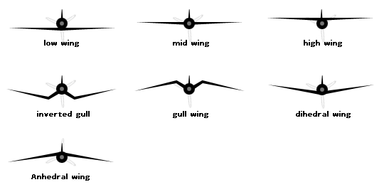
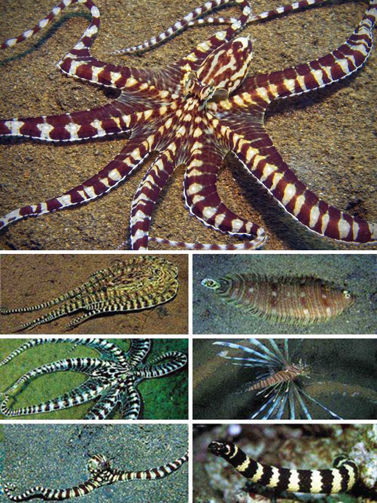
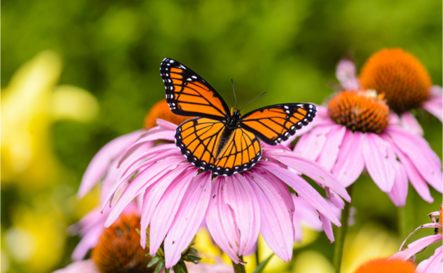
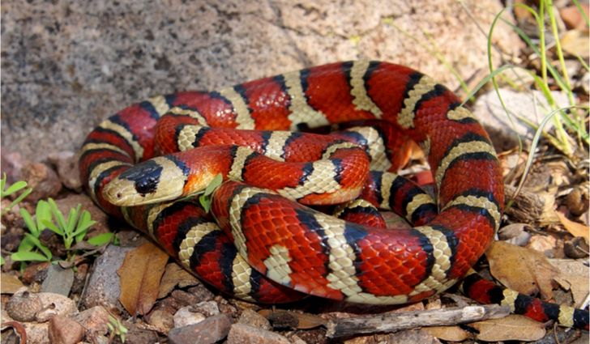
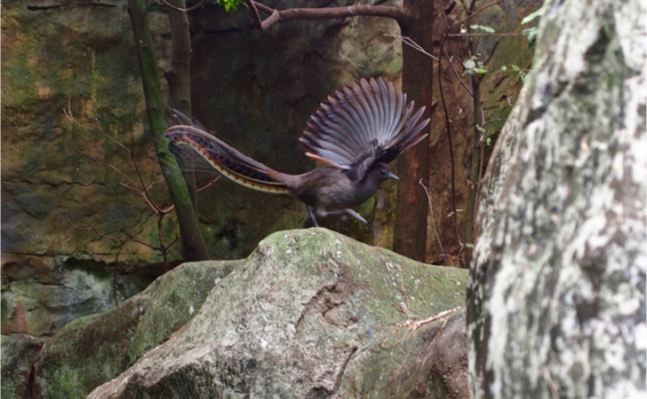
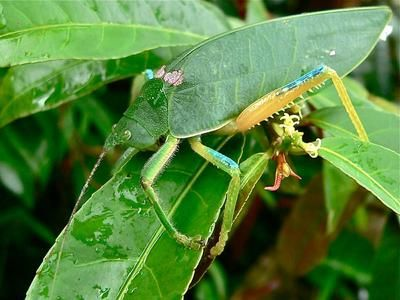
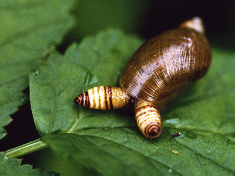
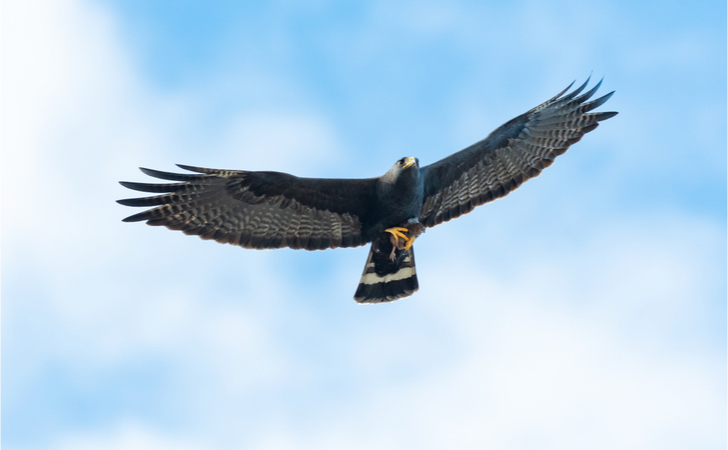

```{r setup, include=FALSE}
knitr::opts_chunk$set(echo = FALSE)
```


## Vocabulary 

| Words from the text | Functions   |  Synonym/explanation in English |
| ------------------- | ------------|------------- |
| Mimecry | Noun | Definition from the article: "an evolved resemblance in appearance or behavior between one organism and another, usually of a different species" |
| To exhibit   | Verb | To present something         |
| To highlight  | Verb  | To put in evidence                    |
|  The marsh gentian | Noun   | A plant  |
| The  marsh       | Noun | A swamp |
| To trick      |   Verb  |   To make an illusion , to cheat     |
| To hatch |  Verb     |  To get out of a egg |
| The intruder |  Noun   |  Someone who come in unwelcome places    |
| Loosely    |  Adverb  | Free        |
|   A scales      |   Noun   |  A external piece of keratin like for turtles , birds, snakes and the tail of rats |
|     To deter       |  Verb      |      To give fear, to discourage   |
|     A mantis shrimp       |   Noun    |   A crustacean who punch his prey to capture him  |
| To flatten   |  Verb |  To become plat          |
| To raise     |  Verb  |   To elevate           |
|   To bent     | Verb    |       To change the shape         |
|     To sink    |  Verb  |   To drop, To go down             |
|       Harmless     |    Adjective   |   Safe         |
|     Unsavory   |  Adjective  |    Disagreeable to eat              |
| The Wings-click |  Noun  |   The fact of produse sound with wings |
|    A maggot  |  Noun |    For example a larvae of fly      |
|    A robin , a chat     |    Noun |    There are birds                  |
| Dihedral forminf wings | Noun and adjectives |  |
|  A wobble      |  Noun    |   A unsteady motion  |
|     To trigger  |     Verb  |   To cause        |


## Analysis table 

|                              |                                                                     |
| ---------------------------- | ------------------------------------------------------------------- |
| Researchers                  | Victor KRIPROP , profession unknow                       |
| Published in?                | 17 October 2019 at 5 PM                                                     |
| General topic?               | The general topic is the 8 animals who can exhibit the mimecry |
| Procedure/what was examined? |  Their abilities and how use there this ability |
| Conclusions/discovery?       |  The author do a list about mimic specis
| Remaining questions?         | There are no remaining questions at the end of the article 


# Pictures of mimic species present from the article mentioned

The Alcon blue butterfly ( _Phengaris rebeli_ )


The mimic octopus ( _Thaumoctopus mimicus_)



The viceroy butterfly ( _Limenitis archippus_ )



The milk snake ( _Lampropeltis triangulum_ )



The lyrebirds ( For example _Menura novaehollandiae_ )



The Katylid ( For example _Pseudophyllus titan_ )



The snail eyestalk flatworms , a parasite of gasteropoda
( _Leucochloridium paradoxum_ )



The zone-tailed hawk




# citation of the article analysed 
Kiprop, Victor. "8 Animals That Exhibit Mimicry." WorldAtlas, Oct. 17, 2019, worldatlas.com/articles/8-animals-that-exhibit-mimicry.html.

# pictures

All pictures are from the article or google image

# website
<https://www.worldatlas.com/articles/8-animals-that-exhibit-mimicry.html>
consulting the 18 october 2019 at 2 PM 


