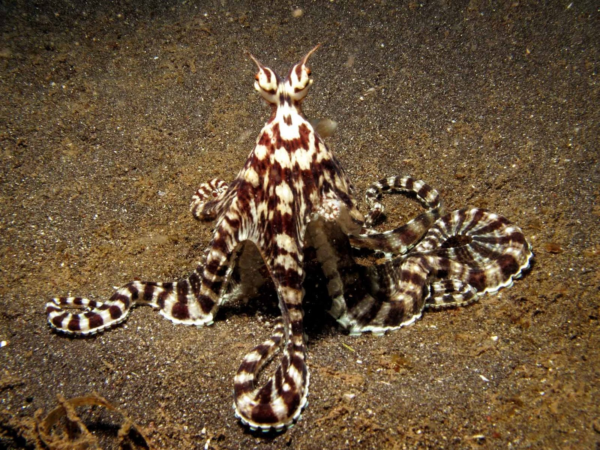
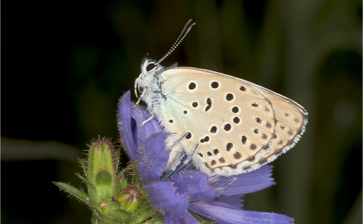
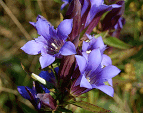

```{r setup, include=FALSE}
knitr::opts_chunk$set(echo = FALSE)
```




## Vocabulary 

| Words from the text | Functions   |  Synonym/explanation in English |
| ------------------- | ------------|------------- |
| Mimecry | Noun | Definition from the article: "an evolved resemblance in appearance or behavior between one organism and another, usually of a different species" |
| To exhibit   | verb | To present something         |
| To highlight  | verb  | To put in evidence                    |
|  The marsh gentian | noun   | a plant  |
| The  marsh       | noun | a swamp |
| To trick      |   verb  |   To make an illusion , to cheat     |
|               |       |                         |
|               |        |                         |


## Analysis table 

|                              |                                                                     |
| ---------------------------- | ------------------------------------------------------------------- |
| Researchers                  | Victor KRIPROP , profession unknow                       |
| Published in?                | 17 October 2019 at 5 PM                                                     |
| General topic?               | The general topic is the 8 animals who can exhibit the mimecry |
| Procedure/what was examined? |  Their abilities and how use there this ability |
| Conclusions/discovery?       |  The author do a list about mimic specis
| Remaining questions?         | There are no remaining questions at the end of the article 


# Pictures of species present from the article mentioned

The Alcon blue butterfly ( _Phengaris rebeli_ )



The marsh gentian ( _Gentiana puberulenta_ )




# citation of the article analysed 
Kiprop, Victor. "8 Animals That Exhibit Mimicry." WorldAtlas, Oct. 17, 2019, worldatlas.com/articles/8-animals-that-exhibit-mimicry.html.

# website
<https://www.worldatlas.com/articles/8-animals-that-exhibit-mimicry.html>
consulting the 18 october 2019 at 2 PM 


