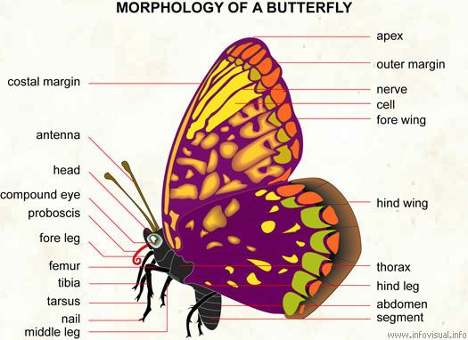

```{r}
knitr::opts_chunk$set(echo = TRUE)
```

# The Helicornius species


# From the article

## Vocabulary 

| Words from the text | Functions   |  Synonym/explanation in English |
| ------------------- | ------------|------------- |
| Agruably | Adverb | Problably, perhaps, maybe,...    |
| Therefore | Adverb | As a result, so |
| Counterintuitive | Adjective | Something opposed to a common-sense or intuitions |
| To prompt |Verb | To encourage something, to cause something |
| To dug down | Verb | To make a hole, in this context it is more  "To reseach" |
| Pairwise | Adjective | Simular |
| Inherent | Adjective | Fundamental |
| Broadly | Adverb | In general without details |
| Tricky | Adjective | Difficult |
| The novelty | Noun | Something unusual, something new |
| Markedly | Adverb | Obvious |
| Somewhat | Adverb | A little |
| The centroid | Noun | A geometric center |
| The lineages | Noun | It's the descendants from a commun  ancestor |
| Brand new | Adjective | Completely new |
| Switcheroo (North USA , informal) | Noun | A change |
| Advergence | Noun | In Biology the advergence is the evolutionary tendency where a species develops characteristics pairwise from another species. This mimic event looks like the co-evolution based of the Müllerian mimecry or the fact that a species imitate another model of species.
| Correspondingly | Adverb | In consequence |
| To grow up | Verb | To become an adult |
| New-frangled (derogatory)| Adjective | Different of what we use usually |
| Apt | Adjective | Given |

### Morphology of butterfly

| Anatomy | Word's function | Definition |
|--------------------|--------------------|---------------------|
| Forewing | Noun | The two first wings of insecta |
| Hindwing | Noun | The two posterior wings of insecta|


## Analysis table 

|                              |                                                                     |
| ---------------------------- | ------------------------------------------------------------------- |
| Researchers ( author)                | Jennifer Hoyal Cuthill , reseachers from the Cambridge's University |
| Author's picture   | |
| Published in?               | 27 August 2019 |
| General topic?              | Heliconius species, a butterfly |
| Procedure/what was examined? |The evolution of two butterfly species of  Heliconius species |
| Conclusions/discovery?       | There are a co-evolution between two species of Heliconius |
| Remaining questions?         | There are "normaly" no remaining questions |


# Bibliography

## Website

<http://www.heliconius.org/2019/mutual-coevolution-in-mullerian-mimicry-arguably-new-data-suggest-yes/>
consulting the 12 November 2019

<https://www.lexico.com/en/definition/advergence>
consulting the 15 November 2019

## Picture

The author: 
<http://www.heliconius.org/author/jfh41/>
consulting the 13 November 2019

the remaining pictures come from google image
