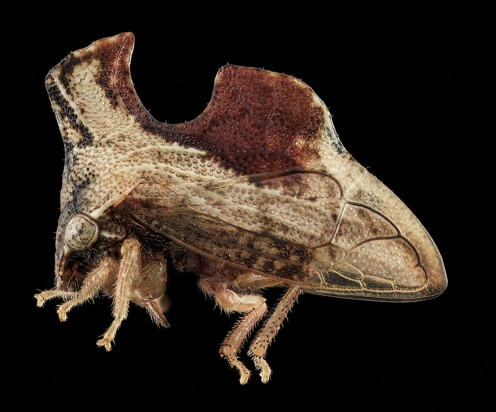
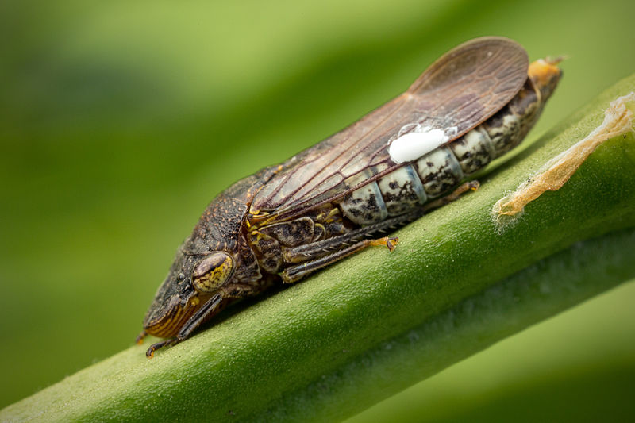

```{r setup, include=FALSE}
knitr::opts_chunk$set(echo = TRUE)
```

# Vocabulary 

| Words from the text | Functions   |  Synonym/explanation in English |
| ------------------- | ------------|------------- |
| Treehopper | Noun | It's a bug living on trees and who has a thorn-shaped  |
| Helmet | Noun | A hard hat |
| To shed light | Verb | To explain  |
| The headgear | Noun | All things who can wear your head |
| The Kernel | Noun | A grain |
| Cozy | Adjective | Something comfortable |
| A mesh | Noun | A network |
| Rooftop | Noun | The surface of the roof |
| To feast | Verb | To make a good meal , To feed  |
| To (mind-)blow | Verb | To impress |
| Indeed | Adverb | In fact ,to be sure  |
| The thorn | Noun | a spine of tree |
| To perch atop | Verb | To be on the peak of something|
| To borrow | Verb | To take something with the aim to return it |
| To seek (sought,sought) | Verb | To resort |
| To tackle | Verb | To take something forward |
| Picky (informal) | Adjective | Fastidious |
| Painstaking | Adjective | To do with a great care |
| Smooth-surfaced | Adjective | Flat-surfaced |
| To wade | Verb | To move with difficulty through something |
| Overwhelmingly | Adverb | With the majority |
| Milkweed | Noun | The monarch butterfly |
| To tinker | Verb | To experiment with something |


## PDF
PDF of the article without pictures and with the vocabulary put in color: 
<https://github.com/DylDelp/dylan-delporte-blog/blob/master/_posts/2019-12-16-article-5/Wing%20genes%20responsible%20for%20tiny%20treehopper.pdf>

# Pictures of the two species mentionned in this article

## Camelback treehopper ( _Entylia carinata_ )



## Glassy winged sharpshooter ( _Homalodisca vitripennis_ )



# Analysis table 

|                              |                                                                     |
| ---------------------------- | ------------------------------------------------------------------- |
| Researchers          | Cera R. Fisher, Jill L. Wegrzyn, Elizabeth L. Jockusch from the University of Connecticut |
| Published in?               | 9 december 2019 |
| General topic?              | The helmet of Treehopper |
| Procedure/what was examined? | The origin of this helmet |
| Conclusions/discovery?       | The genes of the wings code this part of the treehoppers'body|
| Remaining questions?         | "How do we get all these shapes? How do we get all this diversity?" Cera R.Fisher |

# Bibliography 

## website 
https://www.sciencedaily.com/releases/2019/12/191209112152.htm 

consulted the 13 December 2019 at 2 PM and 28 minutes

## Pictures

All pictures are from google image

