```{r setup, include=FALSE}
knitr::opts_chunk$set(echo = FALSE)
```

# Vocabulary 

| Words from the text | Functions   |  Synonym/explanation in English |
| ------------------- | ------------|------------- |
| Elusive | Adjective | To be difficult to reach| 
| Sporting  | Adjective | To be generous  | 
| Telltale | Adjetive | Indicating| 
| Ashore | Adverb | coming up to the sea | 
| To mesmerize | Verb | To hypnotize | 
| A Diorama | Noun | A model in three dimention | 
| To intrigue | Verb | to captive | 
| To arise from (arose, arose, arisen) | Verb  |To start to exist |
| To witness the event| Verb | To see the even | 
| To sketch | Verb | To draw, describe something | 
| Eclectic | Adjective | Wide |
| Slimy | Adjective | Like slime|
| To maroon| Verb | To be lost |
| A beak| Noun | A  piece of the anatomy used to break the food like for bird on the mouth|
| The realm | Noun  | A kingdom|
| The counterpart | Noun | Something with the same function than another thing |
| Squishy | Adjective| Soft |
| The mantle| Noun | The pallium, a piece ofthe anatomy of Mollusca able to create a exoskeleton or a endoskeleton to protect the visceral mass |
| To propel| Verb| To move forward or onward|
| A layer | Noun | It's relative to the endoskeleton in this article |
| To tip | Verb | To move down | 
| To emanate | Verb | To proceed |
| A salami slicer | Noun | A piece of meal cut in small piece |
| To probe| Verb | To ask quetions and find information to reach the answer |
| A handful | Noun | A small amount that we can hand |
| To overlap| Verb | To cover partly|
| Sufficiently | Adverb | Enough |
| pending | Adjective | Uncertain|
| Alas | Abbreviation | Alaska|
| To shatter| Verb | To break |
| A lump| Noun | A irregular compact mass|
| To flesh out | Verb | To provide more information |
| To harbor |Verb | To provide a safe place|
| The dozen | Noun | A set of 12 objects| 
| To cluster | Verb | To come in the same time | 
|The array(s) | Noun | The arrangement |
|The trademark |Noun | A logo|
|To glow| Verb| To shine|
|To blend| Verb| To mix|
|To knit variations on proteins|Verb| To modify proteins|
|To retain| Verb| To maintain|
|To stretch| Verb| To expand|
| A bench | Noun| A long table|
|Blobby| Adjective| Viscous |
|Seemingly| Adverb |Apparently|
|The intricacy |Noun| The act to be complex | 
| Feathery|Adjective | Like feathe , plumed|
| To enshroud| Verb| To hide|
|Awe-inspiring|Adjective| To cause fear being magnificient|


## PDF
PDF of the article without pictures and with the vocabulary put in yellow:

<https://github.com/DylDelp/dylan-delporte-blog/blob/master/_posts/2020-02-16-article-6/The%20Giant%20Squid%20Genome%20Holds%20Surprises.pdf>

# species mentionned in the article (in red in the text )

## Phyllum of Mollusca, Class of Cephalopoda

### SubClass of the octopuses

The two-spot octopus

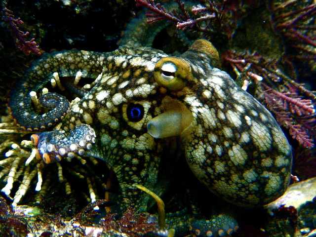

### SubClass of The squids

1) The giant squid , _Architeuthis dux_

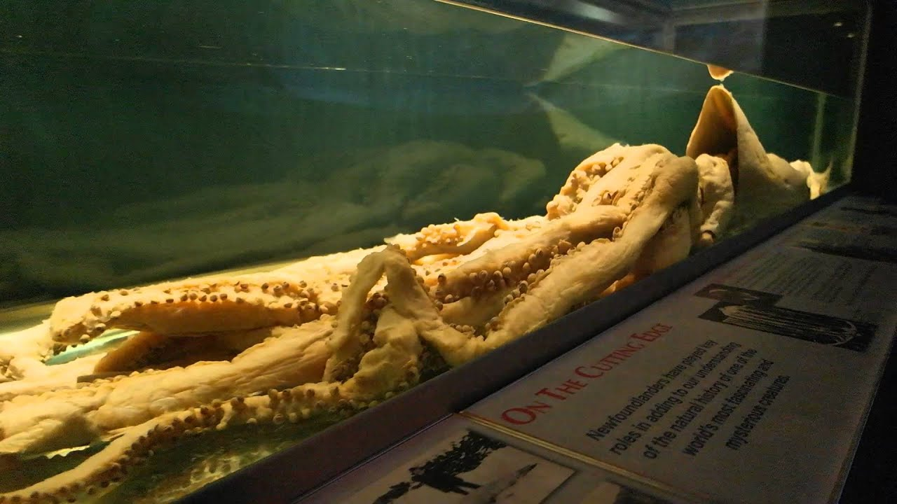

2) The colossal squid, _Mesonychoteuthis hamiltoni_

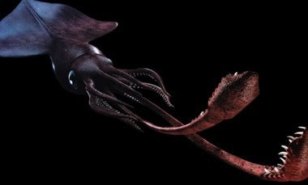

3) Pygmy squids, _Idiosepius paradoxus_

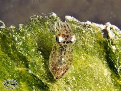

4) The angel clubhook squid, _Ancistroteuthis lichtensteinii_

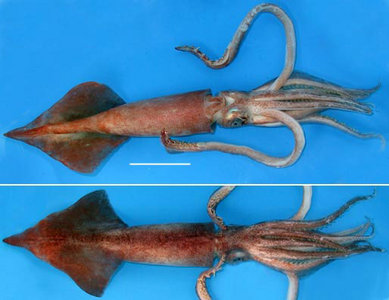

5) The robust clubhook squid, _Onykia robusta_

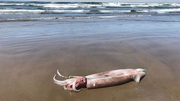

6) The Humboldt squid or jumbo squid, _Dosidicus gigas_


7) The purpleback ( flying ) squid, _Sthenoteuthis oualaniensis_

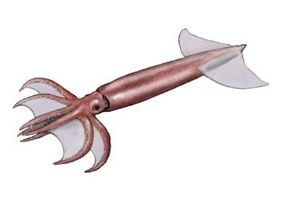

8) The Hawaiian bobtail squid or Bigfin reef squid, _Sepioteuthis lessonianna_


## Phyllum of the Mollusca, Class of Bivalva

The Pacific Oyster, _Crassostrea gigas_

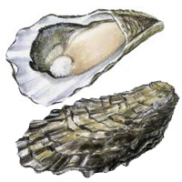

## Phyllum of the Mollusca, Class of Gasteropoda

The giant owl limpet, _Lottia gigantea_

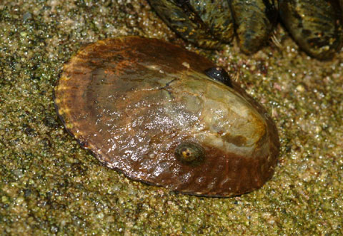

## Another species

1) The sperm whale or cachalot, _Physeter macrocephalus_

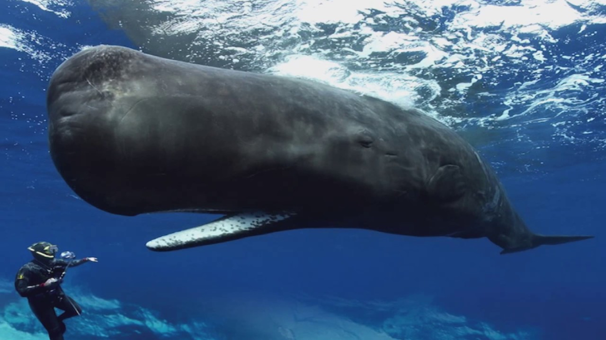

2) The eel, Order of Anguilliformes

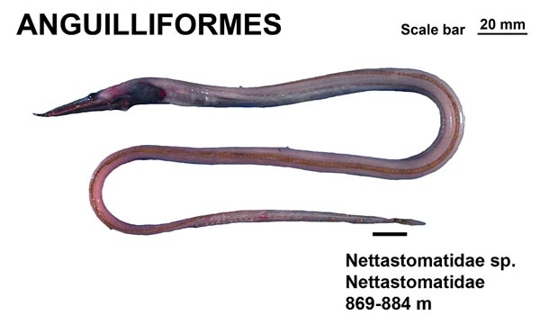

3) The giant seal

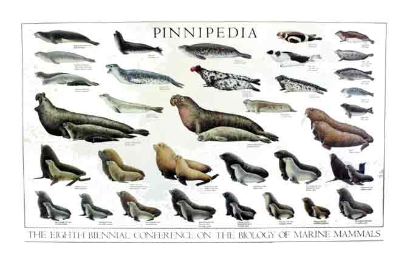

4) The spider mite 
# Analysis table 

|                              |                                                                     |
| ---------------------------- | ------------------------------------------------------------------- |
| Researchers                  |     Ricky Lewis | 
|Bibliography of the researchers | <http://www.rickilewis.com/>  consulting the 17th of February 2020    |
| Published in?                | 10 February 2020 on the website "Technology.org" and the 6 February on the website "DNAscience"                                                  |
| General topic?               | The general topic is the giant squids genome  |
| Conclusions/discovery?       | If species lose Hox Genes or if species gain Hox gene, its body plan will change. That have for consequence that the species can lose or gain a fundamental advantage to survive from the natural selection |
| Remaining questions?         | There are no remaining questions at the end of the article |

# Bibliography

## pictures

All pictures are from the article or google image

## website

<https://www.technology.org/2020/02/10/the-giant-squid-genome-holds-surprises/>
consulting the 15 February 2020 

<https://blogs.plos.org/dnascience/2020/02/06/the-giant-squid-genome-holds-surprises/>
consulting the 17 February 2020

<http://www.rickilewis.com/>
consulting the 17 February 2020


