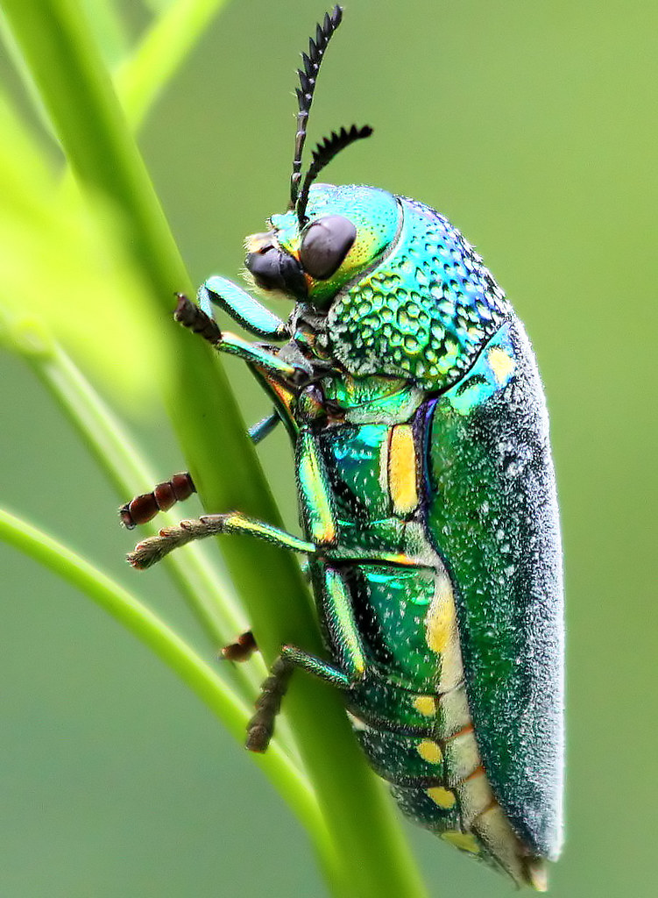

```{r setup, include=FALSE}
knitr::opts_chunk$set(echo = FALSE)
```

# Vocabulary 

| Words from the text | Functions   |  Synonym/explanation in English |
| ------------------- | ------------|------------- |
| Taxonomically | Adverb | It's relatif to the taxonomie|
| Hues | Noun | It's the color or the shade of something| 
| concealment | Adverb | Hinding something|
| Multilayer | Adjective | To be constiting by many layers  |
|To Fare | verb | To pass through |
| Glossy | Adjective| Shiny| 
| Vivid | Adjective| Colorful|
| Conspicious | Adjective| To be clearly seen | 
| To conceal | Verb | To hide something|
| To underlie |Verb | To be under something | 
| The field | Noun| An area |
| To wrap| Verb| To cover | 
| Hereafter| Adverb | "Following time" after a event |
| Avian| Adjective| This word used to talk about something relatif to birds | 
| A covariate| Noun | A variable whose is independent but influence the result with a indirect way|
| A slope | Noun| A surface qualifies of rising or falling| 
| A Cues| Noun| A signal to start |
| The Nail varnish| Noun| It's a colored substance put on nail | 
| Ternary | Adjective| with three parts| 
| A pushpin | Noun| A thumbtack  |
| To overnight| Verb| To remain during the night |
| Handling  | Noun | When you take something in your hands| 
| Rangefinder| Noun | It's a object used to estimate distance with a laser |
|To pin To | Verb | To attach with pin |
| A aperture| Noun | A hole where light pass through | 
| A percentile | Noun| A pourcentage|

## PDF
PDF of the article without pictures and with the vocabulary in red cases:

<https://github.com/DylDelp/dylan-delporte-blog/blob/master/_posts/2020-03-02-article-7/Iridescence%20as%20camouflage%209%20pages.pdf>

# species mentionned in the article and underlined in red 

1) jewel beetle , _Sternocera aequisignata_



2) Common Ivy or English Ivy,  _Hedera helix_ 

3) Mealworm ¸ _Tenebrio molitor_

4) Bramble , _Rubus fructicosus_

5) Beech , _Fagus sylvatica_

6) Holly , _Ilex aquilifolium_

7) Hazel , _Corylus avellana_

# Analysis table 

|                              |                                                                     |
| ---------------------------- | ------------------------------------------------------------------- |
| __Affiliations__        |   __Researchers__  |
| 1. School of Biological Sciences, University of Bristol, Bristol BS8 1TQ, UK | • Karin Kjernsmo
| |• Innes C. Cuthill |
| |• Heather M. Whitney |
| |• Henry Knowles| 
| 2. School of Psychological Science, University of Bristol, Bristol BS8 1TU, UK | • Laszlo Talas |
| | • Nicholas E. Scott-Samuel |
| | • Joanna R. Hall |
| __Published in?__                |   The 23rd of January 2020     |
| __General topic?__               | The iridescence used as camouflage |
| __Conclusions/discovery?__       | |
| __Remaining questions?__         | There are no remaining questions at the end of the article |

# Bibliography

## pictures

All pictures are from the article or google image

## website

<https://www.cell.com/current-biology/fulltext/S0960-9822(19)31608-2#>
consulted the 01st of March 2020 at 9 PM 13

