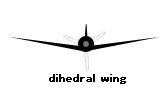

```{r setup, include=FALSE}
knitr::opts_chunk$set(echo = TRUE)
```

First name/surname: Dylan Delporte 


Teacher’s name: Nicolas Devilez


Class name: BAB2 bio, group 4 


Academic year: 2019-2020


# The mimicry, final report

## Table of contents
### 1. Brief introduction
### 2. Seven analyses and articles (in another pdf)
### 2.1. Article 1: 8 animals that exhibit mimicry
### 2.2. Article 2: Caterpillars of peppered moth perceive color through their skin
### 2.3. Article 3: Mutual coevolution in Müllerian mimicry? Arguably, new data suggest yes
### 2.4. Article 4: A homeotic shift late in development drives mimetic color variation in a bumble bee 
### 2.5. Article 5: Wing genes responsible for tiny treehopper’s extraordinary helmet
### 2.6. Article 6: The giant squid genome holds surprises
### 2.7. Article 7: Iridescence as camouflage
### 3. Conclusion
### 4. Bibliography

## 1. Brief introduction

This introduction will introduce you my portfolio about the mimicry.
The mimicry is a strong resemblance between two species (or more). The species who imitate is called mimic and the species (or the object) imitated is called the model. The relation between the two species led to an evolutive convergence where constraints are similar. Likeness can be various according the species concerned. 


Different phenomenon can be linked to several concept like the warning signals. This kind of signals can be visual or olfactive see noisy for predator (but not necessary for another species). Its aim is to warn their predators that it’s not a good idea to eat it because they can be toxic or unsavory. Except some mimetic species who couldn’t be risky.


Studying genes from different mimetic species, it’s possible to see how they are different in spite of the fact the look like similar. Special genes can explain the likeness between species, they are called Homeobox gene (or Hox genes). This Hox genes characterises the position and the function of a body plan since its embryology. Interesting data can be obtained about the mimicry to detect how the likeness is not the only characteristic to have in mind to regroup species.

## 2. Seven analyses and articles (in another pdf)

### 2.1. Article 1: 8 animals that exhibit mimicry

#### Vocabulary

| Words from the text | Functions | Synonym/explanation in English |
| ----------------- | ------------ | ----------- | 
| Mimicry | Noun | Definition from the article: “an evolved resemblance in appearance or behavior between one organism and another, usually of a different species” |
| To exhibit | Verb | To present something |
| To highlight | Verb | To put in evidence |
| The marsh gentian | Noun | A plant |
| The marsh | Noun | A swamp |
| To trick | Verb | To make an illusion, to cheat |
| To hatch | Verb | To get out of an egg |
| The intruder | Noun | Someone who comes in unwelcome places |
| Loosely | Adverb | Free |
| A scales | Noun | An external piece of keratin like for turtles, birds, snakes and the tail of rats |
| To deter | Verb | To give fear, to discourage |
| A mantis shrimp | Noun | A crustacean who punch its prey to capture it |
| To flatten | Verb | To become plat |
| To raise | Verb | To elevate |
| To bent | Verb | To change the shape |
| To sink | Verb | To drop, to go down |
| Harmless | Adjective | Safe |
| Unsavory | Adjective | Disagreeable to eat |
| The Wings-click | Noun | The fact of produce sound with wings |
| A maggot | Noun | For example, a larva of fly |
| A robin, a chat | Noun | It are birds |
| Dihedral forming wings | Noun and adjectives| 
| A wobble | Noun | A unsteady motion |
| To trigger | Verb | To cause |

#### Analysis table

|                              |                                                                     |
| ---------------------------- | ------------------------------------------------------------------- |
| Researchers | Victor KRIPROP |
| Published in ? | The 17th of October 2019 at 5 PM |
| General topic ? | The general topic is the 8 animals who can exhibit the mimicry. |
| Procedure/what was examined ? | What are the abilities of mimetic species about their colors, their noises, their shapes? |
| Conclusions/discovery ? | The author does a list about 8 mimetic species and their characteristic. |
| Remaining questions ? | There are no remaining questions at the end of the article. |


### 2.2. Article 2: Caterpillars of peppered moth perceive color through their skin

#### Vocabulary

| Words from the text | Functions | Synonym/explanation in English |
| ---------- | --------------- | ----------------- |
| A twig | Noun | A piece of wood from a tree |
| To sense | Verb | It’s the abilities of evolve in function of stimulus from the environment in the aim to react by after |
| The surrounding | Noun | Everything who encircle something, the environment |
| The diet | Noun | The food |
| The riddle | Noun | An enigma, a problem to solve like a mystery |
| To blindfold | Verb | To cover eyes with a bandage for example | 

#### Analysis table

|                              |                                                                     |
| ---------------------------- | ------------------------------------------------------------------- |
| Researchers | Max Planck Institute for Chemical Ecology |
| Published in ? | The 2nd of August 2019 |
| General topic ? | The peppered moth’s larvae and its abilities to see colors from its environment. |
| Procedure/what was examined ? | How evolve its abilities to change color without see with its eyes? If larvae are blindfolded, they kept their abilities to “see” the environment’s color. |
| Conclusions/discovery ? | This caterpillar can see its environment’s colors with its skin and its eyes. It adapts its colors to avoid being eaten by predators. |
| Remaining questions ? | There are no remaining questions. |

### 2.3. Article 3: Mutual coevolution in Müllerian mimicry? Arguably, new data suggest yes

#### Vocabulary

| Words from the text | Functions |Synonym/explanation in English | 
| ------------------- | -------------- | ---------|
|Arguably | Adverb | Problably, perhaps, maybe,etc |
| Therefore | Adverb | As a result, so |
| Counterintuitive | Adjective | Something opposed to a common-sense or intuitions |
| To prompt | Verb | To encourage something, to cause something |
| To dug down | Verb | To make a hole, in this context it is more “To research” |
| Pairwise | Adjective | Similar |
| Inherent | Adjective | Fundamental |
| Broadly | Adverb | In general without details |
| Tricky | Adjective | Difficult
| The novelty | Noun | Something unusual, something new |
| Markedly | Adverb | Obvious |
| Somewhat | Adverb | A little |
| The centroid | Noun | A geometric center |
| The lineages | Noun | It’s the descendants from a common ancestor | 
| Brand new | Adjective | Completely new |
| Switcheroo (North USA, informal) | Noun | A change |
| Advergence | Noun | In Biology the advergence is the evolutionary tendency where a species develops characteristics pairwise from another species.This mimic event looks like the co-evolution based of the Müllerian mimicry or the fact that a species imitates another model of species. |
| Correspondingly | Adverb | In consequence |
| To grow up | Verb | To become an adult |
| New-frangled (derogatory) | Adjective | Different of what we use usually |
| Apt | Adjective | Given | 


#### Morphology of butterfly

| Anatomy | Word’s function | Definition | 
| ----------------- | -------------- | ---------------- |
| Forewing | Noun | The two first wings of insecta | 
| Hindwing | Noun | The two posterior wings of insecta | 


#### Analysis table

|                              |                                                                     |
| ---------------------------- | ------------------------------------------------------------------- |
| Researchers (author) | Jennifer Hoyal Cuthill, researchers from the Cambridge’s University |
| Published in ? | The 27th of August 2019 |
| General topic ? | Heliconius species, a butterfly of South America |
| Procedure/what was examined ? | The evolution of two butterfly species of Heliconius species. Are there a co-evolution? |
| Conclusions/discovery ? | There is a co-evolution between two species of Heliconius | 
| Remaining questions ? | There are “normally” no remaining questions | 
 
### 2.4. Article 4: A homeotic shift late in development drives mimetic color variation in a bumble bee 

#### Vocabulary

| Words from the text | Functions | Synonym/explanation in English |
| --------------- | ------------------ | ---------------- | 
| Homeotic | Adjective | Qualify a gene who has a role in the development of the anatomy, organs or body |
| Nonmodel system | Adjective and noun | A system who is not extensively studied |
| Setal (setae) | Noun | A bristle, a thin hair |
| To establish | Verb | To set up |
| A cis-regulatory locus | Noun | A non-coding area of DNA |
| Fate-determining | 
Noun | It’s the fact of understand how a cell becomes in particular a final part of an organism
| The pleotropy | Noun | It’s a phenomenon where one gene influences two other genes or more than two |
| To decipher | Verb | To decrypt, decode |
| Distasteful | Adjective | Unpleasant |
| Aposematic | Adjective | In zoology it’s the phenomenon where an animal warns its predator that it’s dangerous | 
| The insight(s) | Noun | The comprehension, the understanding | 
| To co-opt | Verb | To use in another role than the initial one | 
| The introgression | Noun | It’s the transfer of gene between two species by their hybrid |
| To impart | Verb | To communicate, to confer |  
| To uncover | Verb | To found | 
| Melanin, Eumelanin, Pheomelanin | Noun | Pigments | 
| Pathway | Noun | A series of chemicals reactions catalysed by enzymes who are linked |
| Presumably | Adverb | Probably | 
| To alter | Verb | To change the nature of something, its character or its composition | 
| Upstream | Adjective | In the other sens |
| To refine | Verb | To clarify | 
| Fruitful | Adjective | Fertile, productive | 
| Sanger sequencing (PCR) | Noun | It’s a method to determine a sequence of DNA | 
| Holometabolous (metamorphosis) | Adjective | Complete (metamorphosis of insect): larvae, pupae, adult | 
| Pupae | Noun | An inactive and immature state of an insect for example the chrysalis | 
| Pupal | Adjective | That make reference to pupae
| Adulthood | Noun | The mature state of an insect | 
| Callow | Adjective | Immature, without experience |
| The increment | Noun | A gain | 
| Geyish | Adjective | A bit grey | 
| A grayer tinge | Noun | A color grey | 
| Onsite | Adjective - Adverb | Taking place | 
| Regardless | Adverb | Nevertheless | 
| The uptick (North American) | Noun | A little bit increase |
| Male sex comb | Noun | Something that use Drosophila to grasp on the female |
| Forelimb(s) | Noun | Posterior member |
| Hindlimb(s) | Noun | Anterior member |
| Pollen basket or corbicula | Noun | A cavity where the pollen is stocked, surrounded by setae |
| Ferruginous | Adjective | Holding within iron oxyde | 
| The heterotopy | Noun | An abnormal position from the normal placement |
| The insulators | Noun | A substance who blocks the passage of electricity, heat or sound |
| Demarcating | Adjective | Separed |
| Toolkit | Noun | A tools’ set | 
| Indel(s) | Noun | It’s a biological term to qualify the deletion or the insertion of base in DNA (genome) | 
| Desiquilibrium | Noun | Destability |
| The avoidance | Noun | It’s the fact to avoid something |
| Trimming | Noun | Something cut in small pieces | 

#### Analysis table

|                              |                                                                     |
| ---------------------------- | ------------------------------------------------------------------- |
| __Researchers from The Pennsylvania State University__ | __Departement__ |
| Li Tian | Biology | 
| Sarthok Rasique Rahman | Biology | 
| Briana D. Ezray | Entomology | 
| Luca Franzini | Entomology | 
| __Another Researches__ | James P. Strange, Patrick Lhomme and Heather M. Hines | 
| __Published in ?__ | The 6th of November 2019 | 
| __General topic ?__ | The color variation observed by bumble bee | 
| __Procedure/what was examined ?__ | The researchers analyses the genes Hox during the development of bumble bee to see how change the color and what gene occurs this change. | 
| __Conclusions/discovery ?__ | The evolution influences the phenotype in function of the area and the selection-specific of genes. | 
| __Remaining questions ?__ | There are no remaining questions. |

### 2.5. Article 5: Wing genes responsible for tiny treehopper’s extraordinary helmet

#### Vocabulary

| Words from the text | Functions | Synonym/explanation in English | 
| Treehopper | Noun | It’s a bug living on trees and who has a thorn-shaped | 
| Helmet | Noun | A hard hat | 
| To shed light | Verb | To explain | 
| The headgear | Noun |All things who can wear your head | 
| The Kernel | Noun | A grain | 
| Cozy | Adjective | Something comfortable | 
| A mesh | Noun | A network |
| Rooftop | Noun | The surface of the roof | 
| To feast | Verb | To make a good meal, to feed | 
| To (mind-)blow | Verb | To impress |
| Indeed | Adverb | In fact, to be sure |
| The thorn | Noun | A spine of tree |
| To perch atop | Verb | To be on the peak of something |
| To borrow | Verb | To take something with the aim to return it | 
| To seek (sought,sought) | Verb | To resort | 
| To tackle | Verb | To take something forward | 
| Picky (informal) | Adjective | Fastidious | 
| Painstaking | Adjective | To do with a great care |
| Smooth-surfaced | Adjective | Flat-surfaced | 
| To wade | Verb | To move with difficulty through something | 
| Overwhelmingly | Adverb | With the majority | 
| Milkweed | Noun | The monarch butterfly |
| To tinker | Verb | To experiment with something | 

#### Analysis table

|               |                                     |
| ---------------------------- | ------------------------------------------------------------------- |
| Researchers | Cera R. Fisher, Jill L. Wegrzyn, Elizabeth L. Jockusch from the University of Connecticut |
| Published in ? | The 9th of December 2019 | 
| General topic ? | The helmet of Treehopper |
| Procedure/what was examined ? | The origin of this helmet | 
| Conclusions/discovery ? | The genes of the wings code this part of the treehoppers’ body named helmet | 
| Remaining questions ? | “How do we get all these shapes? How do we get all this diversity?” Cera R.Fisher |

### 2.6. Article 6: The giant squid genome holds surprises

#### Vocabulary

| Words from the text | Functions | Synonym/explanation in English |
| ----------------- | ------------ | ---------------- |
| Elusive | Adjective | To be difficult to reach | 
| Sporting | Adjective | To be generous | 
| Telltale | Adjetive | Indicating | 
| Ashore | Adverb | Coming up to the sea | 
| To mesmerize | Verb | To hypnotize | 
| A Diorama | Noun | A model in three dimensions | 
| To intrigue | Verb | To captive | 
| To arise from (arose, arose, arisen) | Verb | To start to exist |
| To witness the event | Verb | To see the event |
| To sketch | Verb | To draw, describe something | 
| Eclectic | Adjective | Wide | 
| Slimy | Adjective | Like slime |
| To maroon | Verb | To be lost | 
| A beak | Noun | A piece of the anatomy used to break the food like for birds | 
| The realm | Noun | A kingdom | 
| The counterpart | Noun | Something with the same function than another thing |
| Squishy | Adjective | Soft | 
| The mantle | Noun | The pallium, a piece of the anatomy of Mollusca able to create an exoskeleton or an endoskeleton to protect the visceral mass | 
| To propel | Verb | To move forward or onward | 
| A layer | Noun | It’s relative to the endoskeleton in this article | 
| To tip | Verb | To move down | 
| To emanate | Verb | To proceed | 
| A salami slicer | Noun | A piece of meal cut in small piece | 
| To probe | Verb | To wonder several questions and find information to reach the answer | 
| A handful | Noun | A small amount that we can hand | 
| To overlap | Verb | To cover partly | 
| Sufficiently | Adverb | Enough | 
| pending | Adjective | Uncertain | 
| Alas | Abbreviation | Alaska | 
| To shatter | Verb | To break |
| A lump | Noun | A irregular compact mass | 
| To flesh out | Verb | To provide more information | 
| To harbor | Verb | To provide a safe place | 
| The dozen | Noun | A set of 12 objects |
| To cluster | Verb | To come in the same time |
| The array(s) | Noun | The arrangement | 
| The trademark | Noun| A logo |
| To glow | Verb | To shine | 
| To blend | Verb | To mix | 
| To knit variations on proteins | Verb | To modify proteins | 
| To retain | Verb | To maintain | 
| To stretch | Verb | To expand | 
| A bench | Noun | A long table | 
| Blobby | Adjective | Viscous | 
| Seemingly | Adverb | Apparently | 
| The intricacy | Noun | The act to be complex | 
| Feathery | Adjective| Like feathe, plumed | 
| To enshroud | Verb | To hide | 
| Awe-inspiring | Adjective | To cause fear being magnificent |

#### Analysis table

|               |                                     |
| ---------------------------- | ------------------------------------------------------------------- |
| Researchers | Ricky Lewis |
|Bibliography of the researchers | <http://www.rickilewis.com/>   
Last consultation the 17th of April 2020 | 
| Published in ? | The 10th of February 2020 on the website “Technology.org” and the 6th of February on the website “DNA science” | 
| General topic ? | The general topic is the giant squid’s genome |
| Conclusions/discovery ? | If species lose Hox Genes or if species gain Hox gene, its body plan will change. That have for consequence that the species can lose or gain a fundamental advantage to survive from the natural selection |
| Remaining questions ? | There are no remaining questions at the end of the article | 

### 2.7. Article 7: Iridescence as camouflage

#### Vocabulary 

| Words from the text | Functions | Synonym/explanation in English | 
| ------------------ | ------------ | ---------------- |
| Taxonomically | Adverb | It’s relative to the taxonomy |
| Hues | Noun | It’s the color or the shade of something | 
| Concealment | Adverb | Hinding something | 
| Multilayer | Adjective | To be constituting by many layers | 
| To Fare | verb | To pass through |
| Glossy | Adjective | Shiny | 
| Vivid | Adjective | Colorful |
| Conspicious | Adjective | To be clearly seen |
| To conceal | Verb | To hide something | 
| To underlie | Verb | To be under something |
| The field | Noun | An area | 
| To wrap | Verb | To cover | 
| Hereafter | Adverb | “Following time” after an event | 
| Avian | Adjective | This word is used to talk about something relative to birds | 
| A covariate | Noun | A variable whose is independent but influence the result with an indirect way |
| A slope | Noun | A surface qualifies of rising or falling | 
| A Cues | Noun | A signal to start | 
| The Nail varnish | Noun | It’s a colored substance put on nail | 
| Ternary | Adjective | With three parts |
| A pushpin | Noun | A thumbtack | 
| To overnight | Verb | To remain during the night | 
| Handling | Noun | When you take something in your hands | 
| Rangefinder | Noun | It’s an object used to estimate distance with a laser | 
| To pin To | Verb | To attach with pin | 
| An aperture | Noun | A hole where light pass through | 
| A percentile | Noun | A pourcentage |

#### Analysis table
|               |                                     |
| ---------------------------- | ------------------------------------------------------------------- |
| __Affiliations__ | __Researchers__ |
| 1. School of Biological Sciences, University of Bristol, Bristol BS8 1TQ, UK | • Karin Kjernsmo | 
| | • Innes C. Cuthill |
| | • Heather M. Whitney | 
| | • Henry Knowles | 
| 2. School of Psychological Science, University of Bristol, Bristol BS8 1TU, UK | • Laszlo Talas | 
| | • Nicholas E. Scott-Samuel |
| | • Joanna R. Hall |
| __Published in ?__ | The 23rd of January 2020 |
| __General topic ?__ | The iridescence can be used as camouflage to disappear for its predators. | 
| __Conclusions/discovery ?__ | If the color of the iridescence is similar, the animals can become “invisible” for its predators. | 
| __Remaining questions ?__ | There are no remaining questions at the end of the article. | 

## 3. Conclusion

The mimicry is a topic who interest several researchers because this likeness’s abilities occur problems. Is a species 1 or a species 2 who imitate the first species? This kind of problems permit to understand co-evolution between species and the influences of the environment. The same constraints led to the same characteristics in the aim to survive. 


The Hox genes are a tool among several to disappear for predators and increase the survival rate. These genes have a primordial impact to the body. They give shapes, colors and all the structure to the animals and its abilities. 


This topic changes the biologic vision about the word. There is more diversity than we can expect in the environment. A question remains how define a species without consider the likeness? 


## 4. Bibliography

### 4.1. Brief introduction

#### 4.1.1. Website used for the brief introduction

Wolfgang Wickler, “Understanding Mimicry – with Special Reference to Vocal Mimicry.”, Wiley Online Library ,February 1, 2013,


<https://onlinelibrary.wiley.com/doi/abs/10.1111/eth.12061>


Consulted the 16th April 2020 at 9.34 AM 

#### 4.1.2. Scholar material from College Sainte-Gertrude Nivelles (CSGN)

Lesson about gene Hox, Madame Bernard, teacher of biology, 6th Secondary.

#### 4.2.1. Article 1: 8 animals that exhibit mimicry 

##### Article:


Kiprop, Victor. “8 Animals That Exhibit Mimicry.” WorldAtlas, October 17, 2019, 


<https://www.worldatlas.com/articles/8-animals-that-exhibit-mimicry.html>


Last consultation: the 16th of April 2020 at 2.59 PM 

##### Picture of dihedral wings:

Google image

#### 4.2.2. Article 2: Caterpillars of peppered moth perceive color through their skin

###### Article:

Max Planck Institute for Chemical Ecology. “Caterpillars of peppered moth perceive color through their skin.” Science Daily, August 2, 2019, 


<https://www.sciencedaily.com/releases/2019/08/190802104526.htm>


Last consultation: the 16th of April 2020 at 4.30 PM

#### 4.2.3. Article 3: Mutual coevolution in Müllerian mimicry? Arguably, new data suggest yes

##### Article:


Hoyal Cuthill, Jennifer. “Mutual coevolution in Müllerian mimicry? Arguably, new data suggest yes.” Science Daily and Heliconius Homepage too, August 27,2019,


<http://www.heliconius.org/2019/mutual-coevolution-in-mullerian-mimicry-arguably-new-data-suggest-yes/> 


Last consultation: the 16th of April 2020 at 4.36 PM


Lexico, US dictionary. “Definition of advergence in English”. Lexico powered by Oxford,


<https://www.lexico.com/en/definition/advergence>


Last consultation: the 16th of April 2020 at 4.40 PM

##### Picture of morphology of butterfly:

Google image 

#### 4.2.4. Article 4: A homeotic shift late in development drives mimetic color variation in a bumble bee 


Li Tiana, Sarthok Rasique Rahmana, Briana D. Ezrayb, Luca Franzini, James P. Strange, Patrick Lhommea, and Heather M. Hinesa, “A homeotic shift late in development drives mimetic color variation in a bumble bee” , PNAS (Proceedings of the National Academy of Science of the United State of America), first published May 1,2019,


<https://www.pnas.org/content/pnas/116/24/11857.full.pdf?casa_token=tf0WueWSnk0AAAAA:wAeJHZ49IsJZbFFTIz3HFXy7kdDZrchDqHYEuY8uPtvPZuKoqSZVhqulzz3A_DU_MRGk8tLf5nyq0FSI>


Last consultation the 17th of April 2020 at 3.14 PM


#### 4.2.5. Article 5: Wing genes responsible for tiny treehopper’s extraordinary helmet


University of Connecticut, "Wing genes responsible for tiny treehopper's extraordinary helmet." ScienceDaily, December 9, 2019,


<https://www.sciencedaily.com/releases/2019/12/191209112152.htm>


Last consultation the 17th of April 2020 at 7.40 PM


#### 4.2.6. Article 6: The giant squid genome holds surprises


Lewis Ricki, Doctor of Philosophy, “The giant squid genome holds surprises”, Plos Blog (diverse perspectives on science and medicine), DNA Sciences Blog, January 30, 2020,


<https://blogs.plos.org/dnascience/2020/01/30/new-view-of-the-brink-of-cancer-may-validate-preventive-mastectomy/>


Last consultation the 17th of April 2020 at 7.58 PM


#### 4.2.7. Article 7 : Iridescence as camouflage


University of Bristol, “Iridescence as camouflage”, Current Biology, February 3, 2020


<https://www.cell.com/current-biology/fulltext/S0960-9822(19)31608-2#>


Last consultation the 17Th of April 2020 at 8.20 PM
 

#### 4.3. Conclusion


No more website was used 

 
## Link to download a work format of this report

<https://github.com/DylDelp/dylan-delporte-blog/blob/master/_posts/2020-04-20-rapport/The_mimicry.docx>
