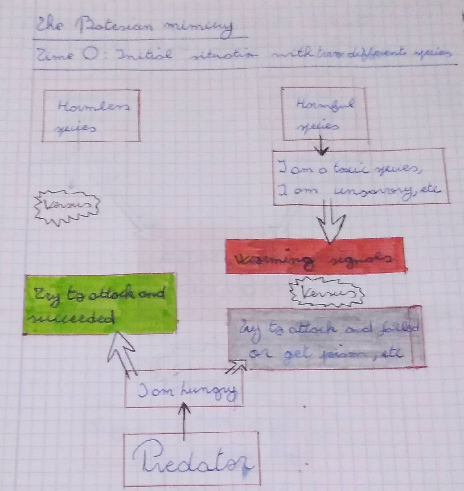
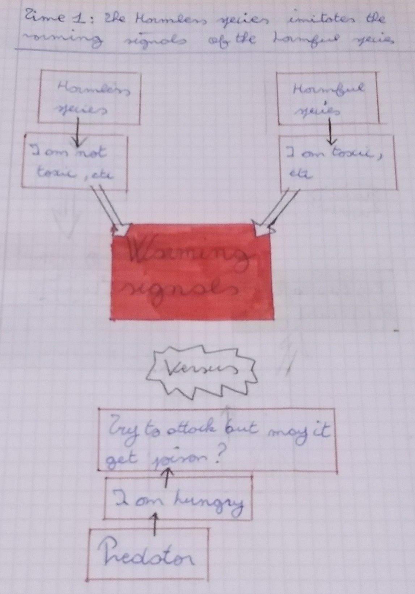

This article would be use to summerise informations about the mimicry basis on the articles and another scientific website.

# Definitions

## The mimicry

The mimicry can be defined as an ressemblance between ogarnisms coming from different species. This ressemblance must be physical with colours, shape, etc or it must be linked by the seem behavior.

There are different situation where mimicry can be defined giving different analysis.

### The Batesian mimicry

The Batesian mimicry qualifies the fact that one species without defenses evolved to look like a harmful species having the seem predators than the species harmless.

### The Müllerian mimicry

