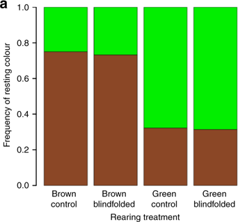

This article would be use to summerise informations  basis on the articles and another scientific website about mimicry.

# Definitions

## The mimicry

The mimicry can be defined as an ressemblance between ogarnisms coming from different species. This ressemblance may be physical with colours, shape, etc or it may be linked by the seem behavior.

There are differents situations where mimicry can be defined through differents analysis.

### The Batesian mimicry

The Batesian mimicry qualifies the fact that one species without defenses evolved to look like a harmful species having the seem predators than the species harmless.

#### Time O : Initial situation with two different species 

At time O we found a harmless species and a harmful species and a predator.
The harmful species is toxic or unsavory,etc and it owns a warming signals to show it.

The values on this histogram is the survival chance in percent fluctuating with the predator action.
This simulation put on evidence that predator get poison,etc. The harmful species obtain a greater survival chance than the harmless species.

After this simulation , we can see that the species harmless is disadvantaged.The predator must eat the harmless species because is easier to eat it in opposition to the harmful species.

#### Time 1: The harmless species imitates the warming signals of the harmful species 

At time 1 we found a harmless species and a harmful species and a predator.
The harmless species and the harmful species own the seem warming signals , furthermore the predator have learnt that this signals mean that the species can injury, be toxic, unsavory,etc.

Simulation : What will happen ?

The values on this histogram is the survival chance in percent fluctuating with the predator action.
This simulation put on evidence that predator get poison,etc. The harmless species and the harmful species obtain a greater survival chance than the time 0.

After this simulation , we can see that the species harmless is advantaged because it look like the harmful species. The predator cannot make a difference between the two species. It have some chance to make a mistake and choose the toxic species.

#### Describing of the batesian mimicry

In the batesian mimicry we can found several type of patterns of signals.

The Aposematism is the fact that a toxic species highlight vivid to signal its toxicity. The predators see the signals and by experience know this toxicity. Some harmless species adapts to imitate this vivid signals in the aim to signal a false toxicity and be avoiding by predators.
This mimic can be imperfect and it stay some difference between the mimic species and the harmful species recognising by the predator.

There are a acoustic mimicry where a flying species creates sounds that their predator can detect by echolocalisation.This special sounds is a equivalent of a aposematic signal avoided by the predator. Some mimic species are able to imitate this acoustic signals.

The sound is a weapons used by some predator to attract its prey like for Katalid or Lyrebirds. Their aim is to attract their prey producing the seem sounds to pretend be like it.

### The Müllerian mimicry

The Müllerian mimicry qualifies the fact that one species with defenses evolved to look like a harmful species having the seem predators and the seem defensive way than the first species harmful.

For example : Bee and Wasp owning yellow and black band.

# How change its color to become invisible ?

Some species can change its hues to conceal itself but how procced they ? 

Some caterpillar change hues after take a look of the background.
If the background is brown, they become brown to disappear to the predator-eyes. For the _Biston betularia_ or pepered moth , we can observe that its larvae can change color in spite of the fact that its eyes is blindfolded withblack acrilyc paint. During its evolution the species become able to express their perception-genes with their eyes and skin to increase their survival chance.

# Bibliography

<https://www.nature.com/articles/s42003-019-0502-7>
consulted the 15th of March 2020 at 4pm and 32 minutes

