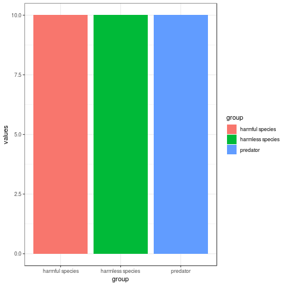

This article would be use to summerise informations about the mimicry basis on the articles and another scientific website.

# Definitions

## The mimicry

The mimicry can be defined as an ressemblance between ogarnisms coming from different species. This ressemblance must be physical with colours, shape, etc or it must be linked by the seem behavior.

There are different situation where mimicry can be defined giving different analysis.

### The Batesian mimicry

The Batesian mimicry qualifies the fact that one species without defenses evolved to look like a harmful species having the seem predators than the species harmless.

#### Time O : Initial situation with two different species 

At time O we found a harmless species and a harmful species and a predator.
The harmful species is toxic or unsavory,etc and it owns a warming signals to show it.
The predator try to eat the two different species.

Simulation : What will happen ?

After this simulation , we can see that the species harmless is disadvantaged.The predator must eat the harmless species because is easier to eat it in opposition to the harmful species.

#### Time 1: The harmless species imitates the warming signals of the harmful species 

At time 1 we found a harmless species and a harmful species and a predator.
The harmless species and the harmful species own the seem warming signals , furthermore the predator have learnt that this signals mean that the species can injury, be toxic, unsavory,etc.

Simulation : What will happen ?

After this simulation , we can see that the species harmless is advantaged because it look like the harmful species. The predator cannot make a difference between the two species. It have some chance to make a mistake and choose the toxic species.

### The Müllerian mimicry

