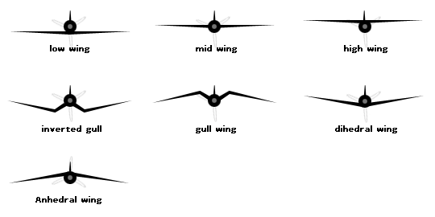

```{r setup, include=FALSE}
knitr::opts_chunk$set(echo = TRUE)
```

# A

| Article | Words from the text | Functions   |  Synonym/explanation in English |
| ------- | ------------------- | ------------|------------- |
|3| Agruably | Adverb | Problably, perhaps, maybe,...    |

# B

| Article | Words from the text | Functions   |  Synonym/explanation in English |
| --------- | ---------- | ------------|------------- |
|1|   To bent     | Verb    |       To change the shape         |
|2| To blindfold | Verb | To cover eyes with a bandage for example |
|3| Broadly | Adverb | In general without details |

# C

| Article | Words from the text | Functions   |  Synonym/explanation in English |
| ---------- | --------- | ------------|------------- |
|1|    A chat   |    Noun |    It's a bird                  |
|3| Counterintuitive | Adjective | Something opposed to a common-sense or intuitions |

# D

| Article | Words from the text | Functions   |  Synonym/explanation in English |
| ----------- | -------- | ------------|------------- |
|2| The diet | Noun | The food |
|1| Dihedral forming wings | Noun and adjectives |  |
|1| To deter   |  Verb   |  To give fear, to discourage   |
|3| To dug down | Verb | To make a hole, in this context it is more  "To reseach" |

# E

| Article | Words from the text | Functions   |  Synonym/explanation in English |
| ------------ | ------- | ------------|------------- |
| 1 | To exhibit   | Verb | To present something         |

# F

| Article | Words from the text | Functions   |  Synonym/explanation in English |
| ------------- | ------ | ------------|------------- |
|1| To flatten   |  Verb |  To become plat          |

# G

| Article | Words from the text | Functions   |  Synonym/explanation in English |
| --------- | ---------- | ------------|------------- |

# H

| Article | Words from the text | Functions   |  Synonym/explanation in English |
| ----- | ------------------- | ------------|------------- |
|1|  Harmless     |    Adjective   |   Safe         |
|1| To hatch |  Verb     |  To get out of a egg |
|1| To highlight  | Verb  | To put in evidence                    |


# I 

| Article | Words from the text | Functions   |  Synonym/explanation in English |
| ---------- | --------- | ------------|------------- |
|3| Inherent | Adjective | Fundamental |
|1| A intruder |  Noun   |  Someone who comes in unwelcome places    |

# J 

| Article | Words from the text | Functions   |  Synonym/explanation in English |
| -------- | ----------- | ------------|------------- |

# K

| Article | Words from the text | Functions   |  Synonym/explanation in English |
| --------- | ---------- | ------------|------------- |

# L 

| Article | Words from the text | Functions   |  Synonym/explanation in English |
| --------- | ---------- | ------------|------------- |
|1| Loosely    |  Adverb  | Free     |

# M

| Article | Words from the text | Functions   |  Synonym/explanation in English |
| --------- | ---------- | ------------|------------- |
|1|   A maggot  |  Noun |    For example a larvae of fly      |
|1|  A mantis shrimp       |   Noun    |   A crustacean who punch its prey to capture it  |
|3| Markedly | Adverb | Obvious |
|1| The  marsh       | Noun | A swamp |
|1| The marsh gentian | Noun   | A plant  |
|1| Mimicry | Noun | Definition from the article: "an evolved resemblance in appearance or behavior between one organism and another, usually of a different species" |

# N

| Article | Words from the text | Functions   |  Synonym/explanation in English |
| ------- | ------------ | ------------|------------- |
|3| The novelty | Noun | Something unusual, something new |

# O 

| Article | Words from the text | Functions   |  Synonym/explanation in English |
| -------- | ----------- | ------------|------------- |

# P

| Article | Words from the text | Functions   |  Synonym/explanation in English |
| --------- | ---------- | ------------|------------- |
|3| Pairwise | Adjective | Simular |
|3| To prompt |Verb | To encourage something, to cause something |

# Q 

| Article | Words from the text | Functions   |  Synonym/explanation in English |
| -------- | ----------- | ------------|------------- |

# R 

| Article | Words from the text | Functions   |  Synonym/explanation in English |
| ------- | ------------ | ------------|------------- |
|1| To raise     |  Verb  |   To elevate           |
|2| The riddle | Noun | A enigma, a problem to solve like a mystery |
|1|    A robin    |    Noun |    It's a bird                  |

# S 

| Article | Words from the text | Functions   |  Synonym/explanation in English |
| -------- | ----------- | ------------|------------- |
|1| A scales  |   Noun   |  A external piece of keratin like for turtles , birds, snakes and the tail of rats |
|2| To sense | Verb | It's the abilities of evolve in fonction of stimulus from the environment to can react by after |
|1|     To sink    |  Verb  |   To drop, To go down             |
|2| The surrounding | Noun  | Everything who encircle something , the environment |

# T 

| Article | Words from the text | Functions   |  Synonym/explanation in English |
| -------- | ----------- | ------------|------------- |
|3| Therefore | Adverb | As a result, so |
|1| To trick      |   Verb  |   To make an illusion , to cheat     |
|3| Tricky | Adjective | Difficult |
|1|     To trigger  |     Verb  |   To cause        |
|2| A twig  |  Noun | A piece of wood from a tree |

# U

| Article | Words from the text | Functions   |  Synonym/explanation in English |
| -------- | ----------- | ------------|------------- |
|1|     Unsavory   |  Adjective  |    Disagreeable to eat              |

# V

| Article | Words from the text | Functions   |  Synonym/explanation in English |
| --------- | ---------- | ------------|------------- |

# W

| Article | Words from the text | Functions   |  Synonym/explanation in English |
| ------- | ------------ | ------------|------------- |
|1| The Wings-click |  Noun  |   The fact of produse sound with wings |
|1|  A wobble      |  Noun    |   A unsteady motion  |

# Y

| Article | Words from the text | Functions   |  Synonym/explanation in English |
| -------- | ----------- | ------------|------------- |

# Z

| Article | Words from the text | Functions   |  Synonym/explanation in English |
| -------- | ----------- | ------------|------------- |


# article 3
| Words from the text | Functions   |  Synonym/explanation in English |
| ------------------- | ------------|------------- |


| Somewhat | Adverb | A little |
| The centroid | Noun | A geometric center |
| The lineages | Noun | It's the descendants from a commun  ancestor |
| Brand new | Adjective | Completely new |
| Switcheroo (North USA , informal) | Noun | A change |
| Advergence | Noun | In Biology the advergence is the evolutionary tendency where a species develops characteristics pairwise from another species. This mimic event looks like the co-evolution based of the Müllerian mimecry or the fact that a species imitate another model of species.
| Correspondingly | Adverb | In consequence |
| To grow up | Verb | To become an adult |
| New-frangled (derogatory)| Adjective | Different of what we use usually |
| Apt | Adjective | Given |

| Anatomy | Word's function | Definition |
|--------------------|--------------------|---------------------|
| Forewing | Noun | The two first wings of insecta |
| Hindwing | Noun | The two posterior wings of insecta|


# article 4
| Words from the text | Functions   |  Synonym/explanation in English |
| ------------------- | ------------|------------- |
| Homeotic | Adjective | Qualify a gene who has a rol in the development of the anatomy, organs or body|


| Words from the text | Functions   |  Synonym/explanation in English |
| ------------------- | ------------|------------- |
| Nonmodel system | Adjective and noun | A system who is not extensively studied |
| Setal (setae) | Noun | a bristel, a thin hair |


| Words from the text | Functions   |  Synonym/explanation in English |
| ------------------- | ------------|------------- |
| To establish | Verb | To set up |
| A cis-regulatory locus| Noun | A non-coding area of DNA |
| Fate-determining | | |
| The pleotropy | Noun | It's a phenomenon where one gene influences two other genes or more than two|
| To Decipher | Verb | To decrypt , decode|
| Distasteful | Adjective | unpleasant |
| Aposematic | Adjective | In zoology it's the phenomenon where a animal warm its predator that it's dangerous |
| The insight(s)| Noun | the comprehension, the understanding |
| To co-opt | Verb | To use in another role than the initial one|
| The introgression | Noun| it's the transfer of gene between two species by theirs hybrid |

How that was study ?


| Words from the text | Functions   |  Synonym/explanation in English |
| ------------------- | ------------|------------- |
| To impart | Verb| to communicate, to confer|
| To uncover| Verb | To found|
| Melanin, Eumelanin, Pheomelanin| Noun| Pigments|
| Pathway |Noun | A serie of chemicals reactions catalysed by enzymes who are linked |
| Presumably| Adverb | Probably | 
| To alter | Verb | To change the natuur of something , its character or its composition|
| Upstream | Adjective | In the other sens|


| Words from the text | Functions   |  Synonym/explanation in English |
| ------------------- | ------------|------------- |
| To refine | Verb | To clarify |
| Fruitful | Adjective | Fertile, productive |
| Sanger sequencing (PCR) | Noun | It's a method to determine a sequence of DNA |
| Holometabolous (metamorphosis) | Adjective | complete (metamophosis of insect ) : larvae, pupae , adult | 
| Pupae| Noun| An inactive and immature state of an insect for example the chrysalis |
| Pupal| Adjective | that make reference to pupae |
| Adulthood | Noun | The mature state of an isect |
| Callow | Adjective | Immature , without experience|
| The Increment | Noun| A gain| 
| Geyish| Adjective | A bit grey |
| A grayer tinge | Noun | A color grey |
| Onsite | Adjective - Adverb | Taking place|
| Regardless| Adverb | Nevertheless|
| The uptick (North American) | Noun| A little bit increase |
| Male sex comb | Noun | something that use Drosophila to grasp on the female |
| Forelimb(s) | Noun | Posterior member |
| Hindlimb(s) | Noun | Anterior member|
| corbicula pollen basket | Noun | a cavity where the pollen is stocked ,surrounded by setae |


| Words from the text | Functions   |  Synonym/explanation in English |
| ------------------- | ------------|------------- |
| Ferruginous | Adjective| holding within iron oxyde |
| The heterotopy | Noun | A abnormal position from the normal placement |
| The insulators | Noun | A substance who blocks the passage of electricity , heat or sound|
| Demarcating | Adjective | Separed|
| Toolkit| Noun | A tools' set |
| Indel(s) | Noun | It's a biological term to qualify the deletion or the insection of base in DNA (genome) |
| Desiquilibrium | Noun | Destability|
| The avoidance | Noun | It's the fact to avoid something|
| Trimming | Noun | something cut in small pieces |

# article 5
| Words from the text | Functions   |  Synonym/explanation in English |
| ------------------- | ------------|------------- |
| Treehopper | Noun | It's a bug living on trees and who has a thorn-shaped  |
| Helmet | Noun | A hard hat |
| To shed light | Verb | To explain  |
| The headgear | Noun | All things who can wear your head |
| The Kernel | Noun | A grain |
| Cozy | Adjective | Something comfortable |
| A mesh | Noun | A network |
| Rooftop | Noun | The surface of the roof |
| To feast | Verb | To make a good meal , To feed  |
| To blow | Verb | To impress |
| Indeed | Adverb | In fact ,to be sure  |
| The thorn | Noun | a spine of tree |
| To perch atop | Verb | To be on the peak of something|
| To borrow | Verb | To take something with the aim to return it |
| To seek (sought,sought) | Verb | To resort |
| To tackle | Verb | To take something forward |
| Picky (informal) | Adjective | Fastidious |
| Painstaking | Adjective | To do with a great care |
| Smooth-surfaced | Adjective | Flat-surfaced |
| To wade | Verb | To move with difficulty through something |
| Overwhelmingly | Adverb | With the majority |
| Milkweed | Noun | The monarch butterfly |
| To tinker | Verb | To experiment with something |

# article 6


