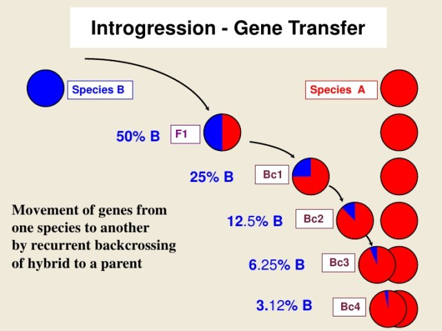

```{r setup, include=FALSE}
knitr::opts_chunk$set(echo = TRUE)
```


# Vocabulary (in yellow in the article and underlined in blue because there are a unknown bug )

| Words from the text | Functions   |  Synonym/explanation in English |
| ------------------- | ------------|------------- |
| Homeotic | Adjective | Qualify a gene who has a rol in the development of the anatomy, organs or body|


| Words from the text | Functions   |  Synonym/explanation in English |
| ------------------- | ------------|------------- |
| Nonmodel system | Adjective and noun | A system who is not extensively studied |
| Setal (setae) | Noun | a bristel, a thin hair |


| Words from the text | Functions   |  Synonym/explanation in English |
| ------------------- | ------------|------------- |
| To establish | Verb | To set up |
| A cis-regulatory locus| Noun | A non-coding area of DNA |
| Fate-determining | Noun | It's the fact of understand how a cell in particular becomes a final part of a organism|
| The pleotropy | Noun | It's a phenomenon where one gene influences two other genes or more than two|
| To Decipher | Verb | To decrypt , decode|
| Distasteful | Adjective | unpleasant |
| Aposematic | Adjective | In zoology it's the phenomenon where a animal warm its predator that it's dangerous |
| The insight(s)| Noun | the comprehension, the understanding |
| To co-opt | Verb | To use in another role than the initial one|
| The introgression | Noun| it's the transfer of gene between two species by theirs hybrid |

How that was study ?


| Words from the text | Functions   |  Synonym/explanation in English |
| ------------------- | ------------|------------- |
| To impart | Verb| to communicate, to confer|
| To uncover| Verb | To found|
| Melanin, Eumelanin, Pheomelanin| Noun| Pigments|
| Pathway |Noun | A serie of chemicals reactions catalysed by enzymes who are linked |
| Presumably| Adverb | Probably | 
| To alter | Verb | To change the natuur of something , its character or its composition|
| Upstream | Adjective | In the other sens|


| Words from the text | Functions   |  Synonym/explanation in English |
| ------------------- | ------------|------------- |
| To refine | Verb | To clarify |
| Fruitful | Adjective | Fertile, productive |
| Sanger sequencing (PCR) | Noun | It's a method to determine a sequence of DNA |
| Holometabolous (metamorphosis) | Adjective | complete (metamophosis of insect ) : larvae, pupae , adult | 
| Pupae| Noun| An inactive and immature state of an insect for example the chrysalis |
| Pupal| Adjective | that make reference to pupae |
| Adulthood | Noun | The mature state of an isect |
| Callow | Adjective | Immature , without experience|
| The Increment | Noun| A gain| 
| Geyish| Adjective | A bit grey |
| A grayer tinge | Noun | A color grey |
| Onsite | Adjective - Adverb | Taking place|
| Regardless| Adverb | Nevertheless|
| The uptick (North American) | Noun| A little bit increase |
| Male sex comb | Noun | something that use Drosophila to grasp on the female |
| Forelimb(s) | Noun | Posterior member |
| Hindlimb(s) | Noun | Anterior member|
| corbicula pollen basket | Noun | a cavity where the pollen is stocked ,surrounded by setae |


| Words from the text | Functions   |  Synonym/explanation in English |
| ------------------- | ------------|------------- |
| Ferruginous | Adjective| holding within iron oxyde |
| The heterotopy | Noun | A abnormal position from the normal placement |
| The insulators | Noun | A substance who blocks the passage of electricity , heat or sound|
| Demarcating | Adjective | Separed|
| Toolkit| Noun | A tools' set |
| Indel(s) | Noun | It's a biological term to qualify the deletion or the insection of base in DNA (genome) |
| Desiquilibrium | Noun | Destability|
| The avoidance | Noun | It's the fact to avoid something|
| Trimming | Noun | something cut in small pieces |

## PDF
PDF of the article without pictures and with the vocabulary put in color: 
<https://github.com/DylDelp/dylan-delporte-blog/blob/master/_posts/2019-12-02-article-4/article4.pdf>

# Analysis table 

|               |                                     |
| ---------------------------- | ------------------------------------------------------------------- |
| __Researchers From The Pennyslvania State University __| __Departement__|
| Li Tian | Biology |
| Sarthok Rasique Rahman | Biology|
| Briana D. Ezray| Entomology |
| Luca Franzini| Entomology | 
| __Another Researches__ | James P.Strange ,Patrick LHomme and Heather M.Hines| 
| __Published in?__                |  The 6 November 2019 |
| __General topic?__               | The color variation observed by bumble bee |
| __Procedure/what was examined?__ | The genes during the development of bumble bee to see how change the color and what gene occurs this change |
| __Conclusions/discovery?__ | The evolution influences the phenotype in function of the area and the selection-specific of genes |
| __Remaining questions?__   | There are no remaining questions |

# Bibliography 

## website 

https://www.pnas.org/content/pnas/116/24/11857.full.pdf?casa_token=tf0WueWSnk0AAAAA:wAeJHZ49IsJZbFFTIz3HFXy7kdDZrchDqHYEuY8uPtvPZuKoqSZVhqulzz3A_DU_MRGk8tLf5nyq0FSI
consulting the 27 Novembrer 2019

## PDF to read the article 

https://github.com/DylDelp/dylan-delporte-blog/blob/master/_posts/2019-12-02-article-4/article.full.pdf

## Pictures

All pictures are from the article or google image
